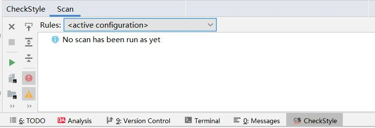
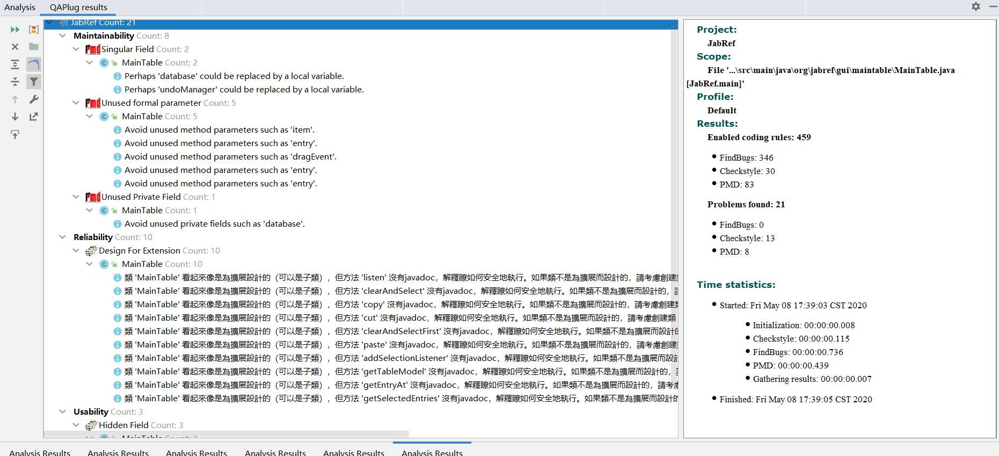

# Software Engineering Project Progress Report

## Issues Chosen:

### Jabref:  
1. <https://github.com/JabRef/jabref/issues/6039>
2. <https://github.com/JabRef/jabref/issues/6198>
3. <https://github.com/JabRef/jabref/issues/6169>
4. <https://github.com/JabRef/jabref/issues/6146>
5. <https://github.com/JabRef/jabref/issues/6180>
6. <https://github.com/JabRef/jabref/issues/5633>

### reasons for choosing issue:

#### [#6039](https://github.com/JabRef/jabref/issues/6039) Font size increase does not increase preferences font size
1. The difficulty for this issue is proper 
2. Fixing this issue can help me understand the whole gui architecture of this project

#### [#6198](https://github.com/JabRef/jabref/issues/6198) Storing selected preview throws java.lang.IllegalArgumentException: Value too long:
1. Valuable and severe bugs, which may encountered by user.
2. A little bit difficult in locating bug.
3. Funny.

#### [#6169](https://github.com/JabRef/jabref/issues/6169) ":PDF" will not show the pdf icon in the
1. Good first issue
2. Should be fixed in recent release 5.1
3. Nobody claims that

#### [#6146](https://github.com/JabRef/jabref/issues/6146) Can't jump in ordered author list by typing letters
1. Previously implemented, but lost in new release.
2. User requirement.
3. Nobody claims that.

#### [#6180](https://github.com/JabRef/jabref/issues/6180) Groups panel does not keep size when resizing window
1. Moderate difficulty for us.
2. User requirement.

#### [#5633](https://github.com/JabRef/jabref/issues/5633) File annotations should be parsed if a file is attached
1. It makes sense to understand user iteration and listen mechanism better.
2. Normal priority and moderate difficulty.

## Test scenario

### [#6039](https://github.com/JabRef/jabref/issues/6039)

We have tried our best to use mock testing method to test. However, we came across inevitable hinder. We can't get the corresponding font size value from css file and only can get the metadata of css which is useless(https://stackoverflow.com/questions/33144735/how-to-get-the-value-of-a-css-definition-in-javafx). Therefore, we can't write tests for this part.

### [#6169](https://github.com/JabRef/jabref/issues/6169)

Tests for getTypeIcon() in LinkedFileViewModel.java:
(The test scripts are in https://github.com/leitianjian/jabref/blob/hand_in_progredd_report/src/test/java/org/jabref/gui/fieldeditors/LinkedFileViewModelTest.java)

Positive_1: If   `LinkedFile` type can be found in `ExternalFileTypes` then display corresponding `JabRefIcon` (In this positive case, it is `PDF` icon)

Positive_2:  If   `LinkedFile` type can be found in `ExternalFileTypes` then display corresponding `JabRefIcon` (In this positive case, it is `WORD` icon)

Negative:  If   `LinkedFile` type can **not** be found in `ExternalFileTypes` then display `JabRefIcons.FILE`

Tests for getExternalFileTypeByName() in ExternalFileTypes.java:

(The test scripts are in https://github.com/leitianjian/jabref/blob/hand_in_progredd_report/src/test/java/org/jabref/gui/externalfiles/ExternalFileTypesTest.java)

Positive: If the `name` passed in method is in `externalFileTypes` list , then output corresponding `externalFileType` (We test three different `externalFileType`s)

Negative: If the `name` passed in method is **not** in `externalFileTypes` list , then output `UnknownExternalFileType`

### [#5633](https://github.com/JabRef/jabref/issues/5633)

This issue can be judged intuitively from the GUI interface. When the file is dragging into the entity, the file annotation tab can appear immediately, the implementation result has been attached. We have tried our best to use mock testing, by mocking the objects to trigger such situation, but in the end it failed. This method involves too many scenarios, such as pressing alt or ctrl in keyboods, it is hard to use mock testing to situmilate specific one. Besides, it is private, it needs table row, coloum, bidentry, context menu etc. to set serveral objects. Therefore, we can't write testing for this bug.

## User story for each issue:

### [#6039](https://github.com/JabRef/jabref/issues/6039) Font size increase does not increase preferences font size
User will want to customize the font size of the UI，not only the main window, but also pop up windows.

before fixing issue:

after fixing the issue:

### [#6198](https://github.com/JabRef/jabref/issues/6198) Storing selected preview throws java.lang.IllegalArgumentException: Value too long:
User want to adjust the entry preview format, but exception occurs.

### [#6169](https://github.com/JabRef/jabref/issues/6169) ":PDF" will not show the pdf icon in the
User want to directed know the linked file type of a entry in main table.

### [#6146](https://github.com/JabRef/jabref/issues/6146) Can't jump in ordered author list by typing letters
User has a habbit to type a letter/digit to jump to target entry after sort some columns.

### [#6180](https://github.com/JabRef/jabref/issues/6180) Groups panel does not keep size when resizing window
User want to keep group pane size when resizing window, so that he/her don't need to resize group pane manually when resizing window.

### [#5633](https://github.com/JabRef/jabref/issues/5633) File annotations should be parsed if a file is attached
User want to check file annotations immediately after dragging file, but don't want to take time for switching entities.

## Results of static code analysis tool

**Note:**
1. Our checkStyle rules can be seen in {$ProjectFolder}/config/checkstyle/checkstyle.xml
2. We are using QAPlug in idea to replace Findbugs and PMD

### During fixing #6039

Checkstyle:

Findbugs/PMD(using QAPlug):

There are no warning generated because of codes modified by us

### During fixing #6198

#### Checkstyle:

#### Findbugs/PMD(using QAPlug):

### During fixing #6169

#### Checkstyle:

#### Findbugs/PMD(using QAPlug):

### During fixing #6146

#### Checkstyle:

#### Findbugs/PMD(using QAPlug):

### During fixing #5633

#### Checkstyle:

#### Findbugs/PMD(using QAPlug):

### Schedule

Week | Issues
:----: | :----
Week 13 | [#6055 Entry removed from group keeps being displayed in entry table](https://github.com/JabRef/jabref/issues/6055) [#6401 JabRef.xml for memory stick mode is not generated when running installed version](https://github.com/JabRef/jabref/issues/6401)
Week 14 | [#6348 Manually fix columns width, define columns' width as (non) flexible](https://github.com/JabRef/jabref/issues/6348) [#6391 Irregular behaviour of "change preview" F9](https://github.com/JabRef/jabref/issues/6391)
Week 15 | [#6259 Searching rescales columns](https://github.com/JabRef/jabref/issues/6259)

#### User stories

##### [#6055 Entry removed from group keeps being displayed in entry table](https://github.com/JabRef/jabref/issues/6055)
When the user deletes selected itemes, a timely updating is needed to better manage his files and not , instead of the deleted item remaining on the interface, which requires switching between different groups.

##### [#6401 JabRef.xml for memory stick mode is not generated when running installed version](https://github.com/JabRef/jabref/issues/6401)
User want JabRef.xml to be generated when apply memory stick mode in preferences, so that this mode can work properly.

##### [#6348 Manually fix columns width, define columns' width as (non) flexible](https://github.com/JabRef/jabref/issues/6348)
User want to init column width the same as the width they set last time before closing JabRef, so that they needn't to resize column width manually when open JabRef next time.

##### [#6391 Irregular behaviour of "change preview" F9](https://github.com/JabRef/jabref/issues/6391)
User wants to change the preview style conveniently, that is at any place, so that it needs to work on every tabs, instead of invalid in the required fields tab.

##### [#6259 Searching rescales columns](https://github.com/JabRef/jabref/issues/6259)
User changes the scale of the column according to the length of the author, file name, etc. Therefore, he does not want to change the width into default scale after searching, which wastes a lot of extra time.
