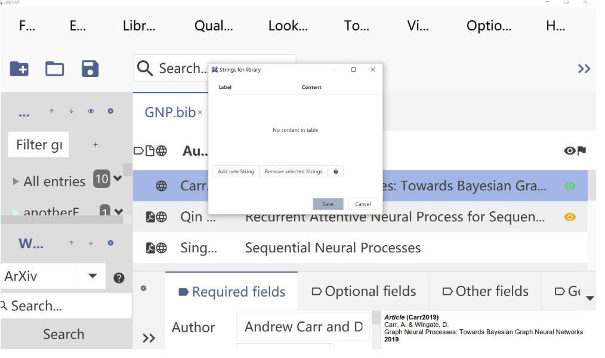
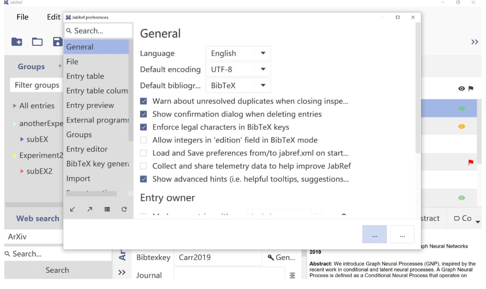
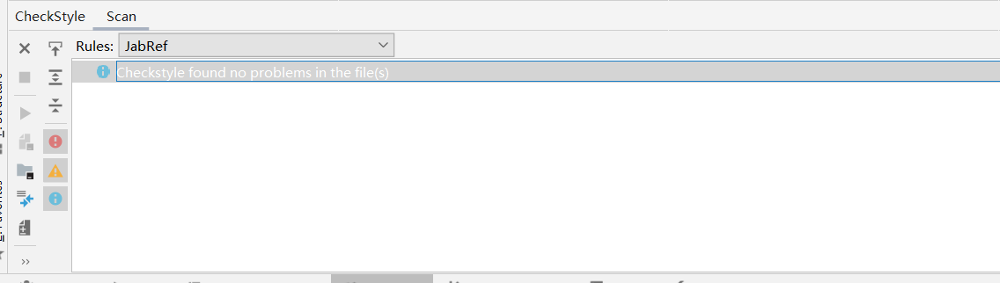
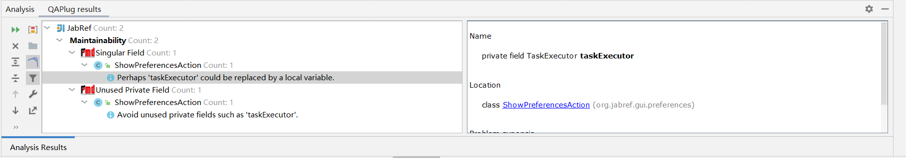

## Issues Chosen:

### Jabref:  
1. <https://github.com/JabRef/jabref/issues/6039>
2. <https://github.com/JabRef/jabref/issues/6198>
3. <https://github.com/JabRef/jabref/issues/6169>
4. <https://github.com/JabRef/jabref/issues/6146>

### reasons for choosing issue:

### [#6039](https://github.com/JabRef/jabref/issues/6039)
1. The difficulty for this issue is proper 
2. Fixing this issue can help me understand the whole gui architecture of this project

### [#6198](https://github.com/JabRef/jabref/issues/6198)
1. Valuable and severe bugs, which may encountered by user.
2. A little bit difficult in locating bug.
3. Funny.

### [#6169](https://github.com/JabRef/jabref/issues/6169)
1. Good first issue
2. Should be fixed in recent release 5.1
3. Nobody claims that

### [#6146](https://github.com/JabRef/jabref/issues/6146)
1. Previously implemented, but lost in new release.
2. User requirement.
3. Nobody claims that.

## User story for each issue:

### [#6039](https://github.com/JabRef/jabref/issues/6039)
User will want to customize the font size of the UI，not only the main window, but also pop up windows.

before fixing issue:

after fixing the issue:

### [#6198](https://github.com/JabRef/jabref/issues/6198)
User want to adjust the entry preview format, but exception occurs.

### [#6169](https://github.com/JabRef/jabref/issues/6169)
User want to directed know the linked file type of a entry in main table.

### [#6146](https://github.com/JabRef/jabref/issues/6146)
User has a habbit to type a letter/digit to jump to target entry after sort some columns

## Results of static code analysis tool

### During fixing #6039

checkstyle:

our checkStyle rules can be seen in {$ProjectFolder}/config/checkstyle/checkstyle.xml

Findbugs/PMD(using QAPlug):

