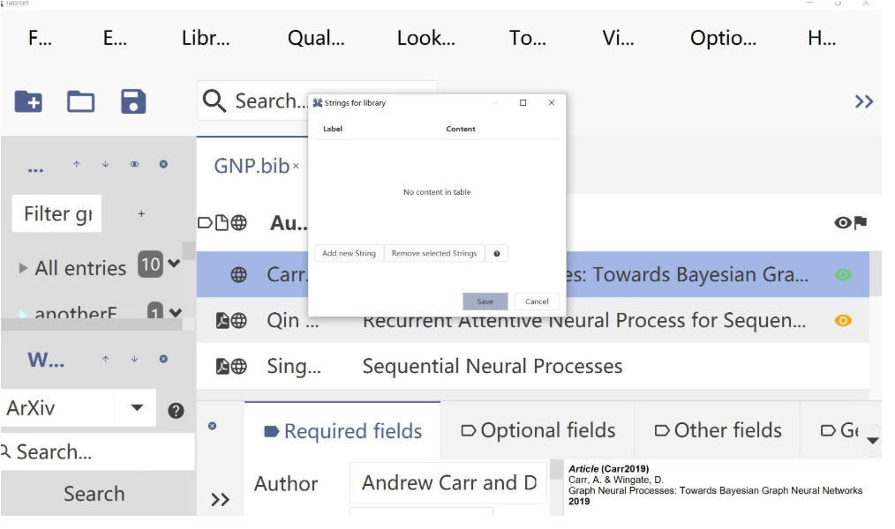
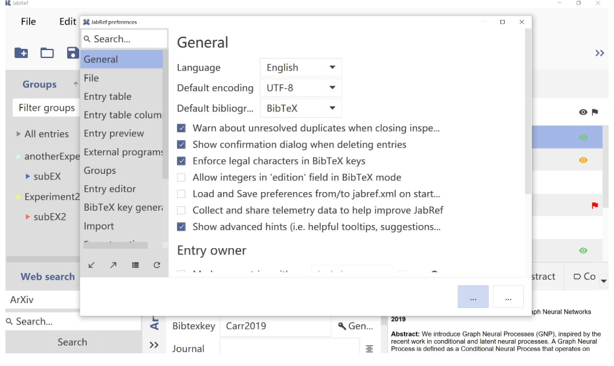
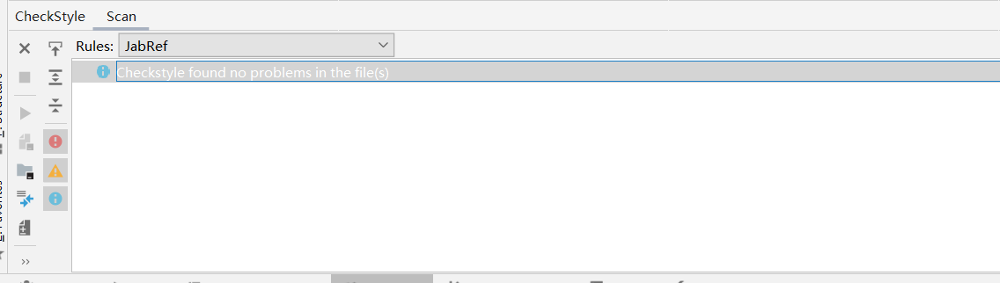
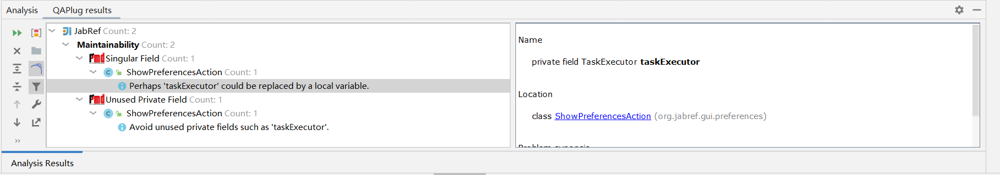

## Issues Chosen:

Jabref:
<https://github.com/JabRef/jabref/issues/6039>

reasons for choosing issue:

#6039: 1. the difficulty for this issue is proper 2. Fixing this issue can help me understand the whole gui architecture of this project

## User story for each issue:

#6039: User will want to customize the font size of the UI，not only the main window, but also pop up windows.

before fixing issue:

after fixing the issue:

## Results of static code analysis tool

### During fixing #6039

checkstyle:

our checkStyle rules can be seen in {$ProjectFolder}/config/checkstyle/checkstyle.xml

Findbugs/PMD(using QAPlug):

