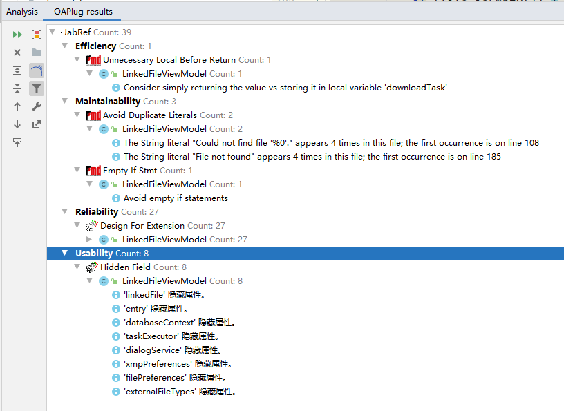

# Software Engineering Project Progress Report

## Issues Chosen:

### Jabref:  
1. <https://github.com/JabRef/jabref/issues/6039>
2. <https://github.com/JabRef/jabref/issues/6198>
3. <https://github.com/JabRef/jabref/issues/6169>
4. <https://github.com/JabRef/jabref/issues/6146>
5. <https://github.com/JabRef/jabref/issues/6180>

### reasons for choosing issue:

#### [#6039](https://github.com/JabRef/jabref/issues/6039) Font size increase does not increase preferences font size
1. The difficulty for this issue is proper 
2. Fixing this issue can help me understand the whole gui architecture of this project

#### [#6198](https://github.com/JabRef/jabref/issues/6198) Storing selected preview throws java.lang.IllegalArgumentException: Value too long:
1. Valuable and severe bugs, which may encountered by user.
2. A little bit difficult in locating bug.
3. Funny.

#### [#6169](https://github.com/JabRef/jabref/issues/6169) ":PDF" will not show the pdf icon in the
1. Good first issue
2. Should be fixed in recent release 5.1
3. Nobody claims that

#### [#6146](https://github.com/JabRef/jabref/issues/6146) Can't jump in ordered author list by typing letters
1. Previously implemented, but lost in new release.
2. User requirement.
3. Nobody claims that.

#### [#6180](https://github.com/JabRef/jabref/issues/6180) Groups panel does not keep size when resizing window
1. moderate difficulty for us.
2. User requirement.

## Test scenario

### [#6039](https://github.com/JabRef/jabref/issues/6039)

We have tried our best to use mock testing method to test. However, we came across inevitable hinder. We can't get the corresponding font size value from css file and only can get the metadata of css which is useless(https://stackoverflow.com/questions/33144735/how-to-get-the-value-of-a-css-definition-in-javafx). Therefore, we can't write tests for this part.

## User story for each issue:

### [#6039](https://github.com/JabRef/jabref/issues/6039) Font size increase does not increase preferences font size
User will want to customize the font size of the UI，not only the main window, but also pop up windows.

before fixing issue:

after fixing the issue:

### [#6198](https://github.com/JabRef/jabref/issues/6198) Storing selected preview throws java.lang.IllegalArgumentException: Value too long:
User want to adjust the entry preview format, but exception occurs.

### [#6169](https://github.com/JabRef/jabref/issues/6169) ":PDF" will not show the pdf icon in the
User want to directed know the linked file type of a entry in main table.

### [#6146](https://github.com/JabRef/jabref/issues/6146) Can't jump in ordered author list by typing letters
User has a habbit to type a letter/digit to jump to target entry after sort some columns.

### [#6180](https://github.com/JabRef/jabref/issues/6180) Groups panel does not keep size when resizing window
User want to keep group pane size when resizing window, so that he/her don't need to resize group pane manually when resizing window.

## Results of static code analysis tool

**Note:**
1. Our checkStyle rules can be seen in {$ProjectFolder}/config/checkstyle/checkstyle.xml
2. We are using QAPlug in idea to replace Findbugs and PMD

### During fixing #6039

Checkstyle:

Findbugs/PMD(using QAPlug):

There are no warning generated because of codes modified by us

### During fixing #6198

#### Checkstyle:

#### Findbugs/PMD(using QAPlug):

### During fixing #6169

#### Checkstyle:

#### Findbugs/PMD(using QAPlug):

### During fixing #6146

#### Checkstyle:

#### Findbugs/PMD(using QAPlug):

